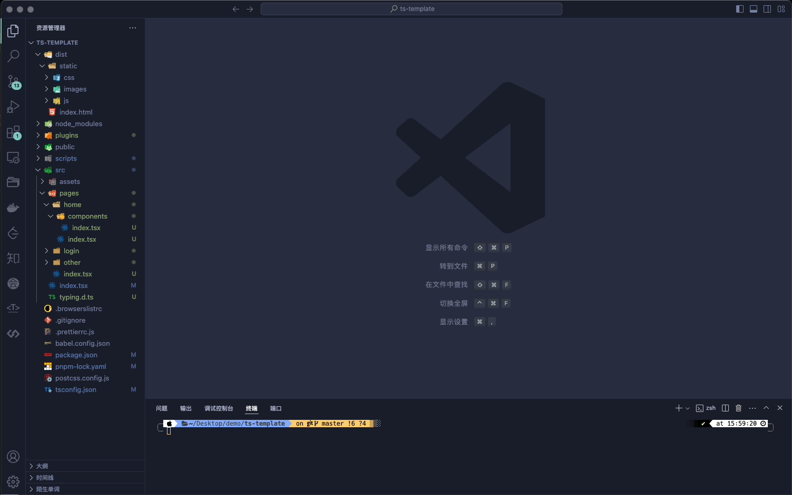

# auto-route-plugin

> 自动生成路由表的 webpack 插件

## 介绍

该插件自动查找src/pages文件夹下面的所有目录，根据文件路径生成对应的路由结构。

## 安装

```bash
pnpm add webpack-plugin-auto-routes -D
# or
yarn add webpack-plugin-auto-routes -D
# or
npm install webpack-plugin-auto-routes -D
```

## 参数

```javascript
interface IAutoRoutes {
  /**
   * 排除的文件夹
   * @default []
   */
  excludeFolders?: string[];
  /**
   * 路由模式
   * @default 'hash'
   */
  routingMode?: 'browser' | 'hash';
  /**
   * 是否只生成路由表(只生成routes文件)
   * @default false
   */
  onlyRoutes?: boolean;
  /**
   * 路由默认路径
   * @default '/index'
   */
  indexPath?: string;
}
```

## 使用

```javascript
// webpack.config.ts
import AutoRoutePlugin from 'webpack-plugin-auto-routes';
// webpack.config.js
const AutoRoutePlugin = require('webpack-plugin-auto-routes');

module.exports = {
  // ...
  plugins: [
    new AutoRoutePlugin({
      excludeFolders: ['components'],
      routingMode: 'browser',
      onlyRoutes: false,
      indexPath: '/home',
    }),
  ],
};
```

## 示例

当你启动项目过后，插件会自动在pages文件夹下生成router文件夹以及相应的内容


